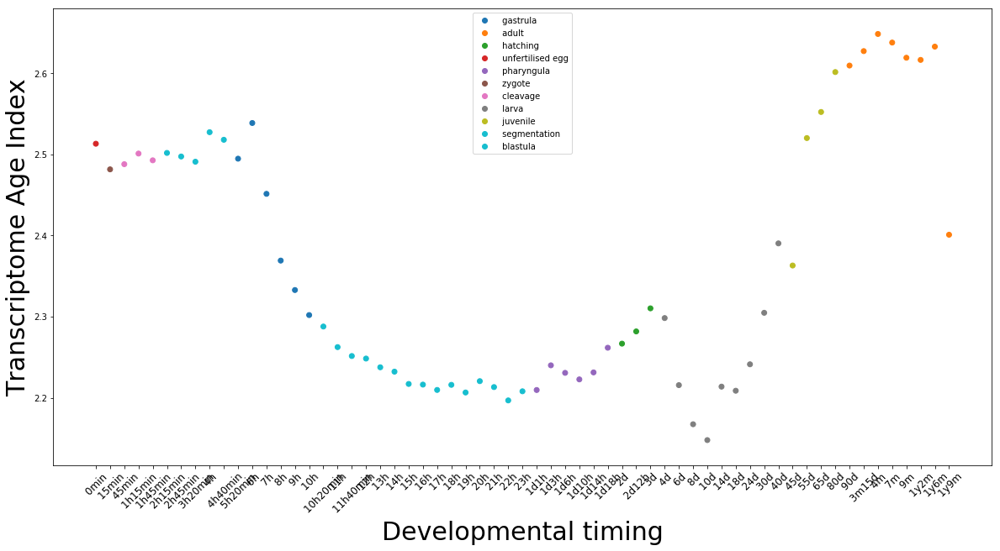
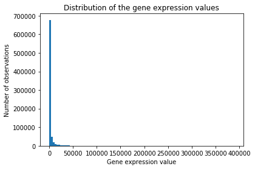
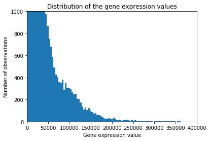
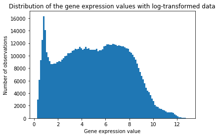
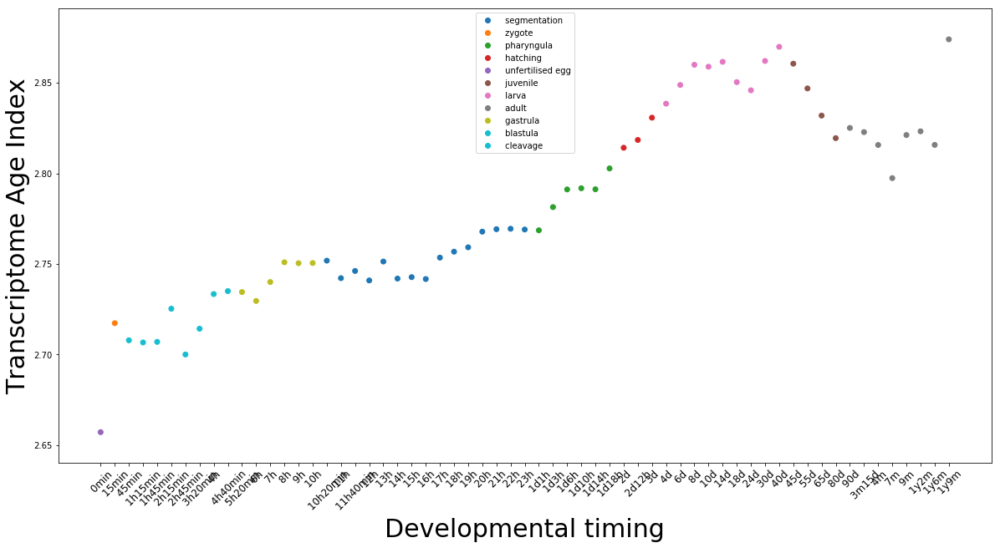

# Case Studies in Bioinformatics, Report

## Module 1: Is the hourglass model for gene expression really supported by the data?


#### Antoine Gurtler, December 2018


### Introduction
During vertebrate ontogeny (*i.e.* development from egg fertilization to adult state), different genes or gene sets are expressed. These genes drive the development through multiples stages. During the 19th and the beginnings of embryology, the first embryologists logically proposed a stepping-stone model where old embryogenic characteristics are conserved and diverged later. This model leads to place a common stage at the beginning of the development (funnel model). It corresponds to the von Baer third law where embryos diverge from each others during development.
Since, it has been observed that a certain stage of development was morphologically common to all kind of vertebrates. But this stage, called 'phylotypic' stage, is not at the beginning of the development. It is found in the middle of the development. It gave birth to the hourglass model. According to it, the mid-embryonic period is conserved among all vertebrates when embryos show, before and after this stage, divergences (1).  This morphological observation was first molecularly supported by Hox genes expression (2). This stage is supposed to be the most constraint and so, the most conserved. Some studies tried to highlight a relation between gene conservation and gene expression among developmental stages, in other words, between phylogeny and ontogeny. Domazet-Lošo and Tautz (3) used phylostratigraphy and stage-specific gene expression data to compute an index representing the evolutionary age of the transcriptome for each stage. Phylostratigraphy gives to genes from a genome a phylogenetic rank based on the age of the gene.  
This report investigates the figure 1a of the Domazet-Lošo and Tautz publication (3). In the paper, they used an index named transcriptome age index (TAI), which "integrates the age of a gene with expression level at a given developmental stage and sums this over all genes expressed at the respective stage" (3). They calculated these scores for expression data of the zebrafish *Danio rerio*. They obtained results supporting the hourglass model. Here, we reproduced the analysis from the untreated data to the figure and discuss the latter. 


### Methods
We reproduced the figure 1a of the paper (3) on python 3 using the following packages: pandas, numpy, GEOparse and matplotlib.pyplot. We used the available expression data from the article and the *dario_age_index.txt* which summarize probIDs, the probe targeted gene name and the phylostrata rank of the gene. 

First, we have to download and extract gene expression data and metadata from the GPL file. These meaningful metadata are the stage, time, sex and sample name. 


```python
import pandas as pd
import numpy as np
import GEOparse
import matplotlib.pyplot as plt
```


```python
# Download the data
file_name = 'GSE24616'
gse = GEOparse.get_GEO(geo=file_name, destdir="./")
# Read in age index data
age_index = pd.read_csv('danio_age_index.txt', sep='\t', header=None)
age_index.columns = ["GeneID","ProbeID","age"]
# Set ProbeID as the index of dataframe
age_index.set_index('ProbeID',inplace=True)
```
```python
# Extract GSE metadata
characteristics = {"stage":[],"time":[],"sex":[],"sample_name":[]}
for gsm_name, gsm in gse.gsms.items():
    characteristics["stage"].append(gsm.metadata['characteristics_ch1'][1].split(":")[1].rstrip())
    characteristics["time"].append(gsm.metadata['characteristics_ch1'][2].split(":")[1].rstrip())
    characteristics["sex"].append(gsm.metadata['characteristics_ch1'][3].split(":")[1].rstrip())
    characteristics["sample_name"].append(gsm_name)
char_df = pd.DataFrame(characteristics,index = characteristics["sample_name"])


# Extract expression data and add ProbeID as the index of gene expression dataframe
data = gse.pivot_samples('VALUE') 
gpl = list(gse.gpls.values())[0]
data.set_index(gpl.table.SPOT_ID,inplace=True)
```

Then we reduced the gene expression datafram (N=45220) to the probIDs found in the *dario.age_index.txt* (N=16188). This file also contains the gene associate with the prob and an integer linked to the gene age (phylogenetic rank = phylostratum) (1 = old, 14 =young).


```python
matched_data =data.join(age_index,how='inner').groupby(level=0).last()
```

Some genes are reported by multiple probes, so we merged their expression together to have one row per gene. Authors of the original paper (3) did not do it (4). Table 'unique_data' contains expression value from every microarray (N=146) for every gene (N=12892) and age index which will used later to compute the TAI. Then, we excluded male samples.

Then, we calculated the average gene expression for similar time points because some microarrays were done in replicates. There is 61 time points, separated in eleven developmental stages. We also associate a developmental stage to the corresponding time points. 


```python
# Average out multiple transcripts
unique_data = matched_data.groupby('GeneID').mean()

# Select only female and mixed sample.
char_df= char_df[char_df["sex"]!=' male']

# find samples of the same time points
experiment_index=[]
time_stamps = char_df.time.unique()
for t in time_stamps:
    experiment_index.append(char_df[char_df['time']==t].index.tolist())

# average the samples for similar time points
set_mean = {}
stages = []
timestamps=[]
for d in range(len(experiment_index)) :
    sample_list=experiment_index[d]
    set_mean[d]=unique_data[sample_list].mean(axis=1)
    stages.append(char_df[char_df.index.isin(sample_list)].stage[0])
    timestamps.append(char_df[char_df.index.isin(sample_list)].time[0])
mean_data = pd.DataFrame(set_mean)
mean_data.columns= stages
```


The final table has 12892 rows and 61 columns, for 12892 genes and 61 time points. 

### Results. 

With this table containing the average gene expression per time point, we can calculate the transcriptome gene index (TAI) of each time point as decribed in the paper. 


* *ps_i* is the phylostratum number of the gene *i* and *e_i* its expression.


```python
# Calculating TAI
age_indices =unique_data['age']
expression_data = mean_data.values
product = np.dot(expression_data.T,age_indices)
mean_expression = expression_data.T.sum(1)
TAI = np.divide(product,mean_expression)
```

We reproduced the figure 1a of the publication by plotting the 61 calculated TAIs. 


```python
# define color map
unique_stages= list(set(stages))
color_list = plt.cm.tab10(np.linspace(0, 1, len(unique_stages))) 
color = {unique_stages[i]:color_list[i] for i in range(len(unique_stages))}
my_col= [color[i] for i in stages]

plt.figure(figsize=(20,10))
plt.scatter(range(len(TAI)),TAI,color=my_col,linestyle='-')
plt.xticks(range(len(TAI)),timestamps,rotation=45,size=12)
plt.ylabel("Transcriptome Age Index",size=30)
plt.xlabel("Developmental timing",size=30)
markers = [plt.Line2D([0,0],[0,0],color=c, marker='o', linestyle='') for c in color.values()]
plt.legend(markers,color.keys(),loc='upper center')
plt.show()
```





*Figure 1: **Figure 1a reproduction**. The x-axis represents the different time points, y-axis is the TAI. Color of the points corresponds to the developmental stage.*

According to this figure, we see that genes expressed during the mid-embryonic and larva period have the lower TAIs, so the oldest genes are expressed during these stages. The pattern is not exactly the same as in the publication. In fact, some probes measure the same gene, in the original publication, the authors did not merged the information obtained for the same gene. It means that some genes contribute more than one time to the graph (4). As explained in the method part, we merged the gene expression when multiple probes pointed for the same gene. This is why we see that the lowest TAIs are found during the larva stage counter to the pattern of the publication.  

However, if we look at the distribution of gene expression values (Figure 2), we see that most of the genes have really low expression. It means that only few genes, ones with a strong expression and possibly some outliers (4), contribute to the observed pattern, which, surely by chance, correponds to a hourglass pattern. 




*Figure 2: **Distribution of the gene expression values**.*




*Figure 3: **Distribution of the gene expression values with reduced y-axis**.*

We reduced the y-axis (Figure 3) to be able to see the data which contribute to the hourglass pattern. 3029.85 is the mean expression value. In the reduced histogramm, we see that a lot of values are above this mean and some are very important (larger than 350'000). There are the ones which contribute the most to the hourglass pattern. 

If we apply a log-transformation to the data. They display a log-normal distribution (Figure 4) which allows to compare data to each other. 




*Figure 4: **Distribution of the log transformed gene expression**.*

Then, we can redo the plot with the log-transformed data.


```python
# Calculating TAI with log transformation
age_indices =unique_data['age']
expression_data = np.log(mean_data.values)
product = np.dot(expression_data.T,age_indices)
mean_expression = expression_data.T.sum(1)
TAI = np.divide(product,mean_expression)
```




*Figure 5: **Transcriptome age index with log-transformed data**.* 

The normalized data changes the pattern of the graph. The lowest TAI are found during the first steps of the developpment. Transcriptome age decreases over time. Data do not show a hourglass pattern anymore.

 

### Discussion:


Is the hourglass model for gene expression really supported by the data ? We can answer this question now and the answer is no. This study shows how important is to normalize data. In fact, only outliers and strong expressed genes contribute to obtain a hourglass model (4). Data seem to support the funnel model. 
Log-transformation is common to analyze microarray data. In fact, every gene has its own scale. Some genes have a strong influence even if they have a really low expression comparate to others strong expressed genes. Without a rescaling, we only observed the highly expressed genes. By doing a log-transformation, we reduce the dynamic range and we can compare genes between them. In fact, as shown on the histograms, there more than five orders of magnitude between expression value. The log-transformation allows us to rescale the expression data. It allows us to 'hear' every gene, not only the loudest and it drastically change the interpretation of the data.

Bias presented in this report are more detailed in Piasecka *et al* (4). They also proposed a robust method to analyze gene expression through different developmental stages. They determined some groups of genes ('modules') which are co-expressed at the same developmental time. Authors analyzed how some genomic characteristics were constrained through different stages. They find out that only conserved regulatory regions follow a hourglass pattern.(4)  


### References:


1. 	Kalinka AT, Tomancak P. The evolution of early animal embryos: conservation or divergence? Trends Ecol Evol. 2012 Jul;27(7):385–93. 
2. 	Duboule D. Temporal colinearity and the phylotypic progression: a basis for the stability of a vertebrate Bauplan and the evolution of morphologies through heterochrony. Dev Camb Engl Suppl. 1994;135–42. 
3. 	Domazet-Lošo T, Tautz D. A phylogenetically based transcriptome age index mirrors ontogenetic divergence patterns. Nature. 2010 Dec;468(7325):815–8. 
4. 	Piasecka B, Lichocki P, Moretti S, Bergmann S, Robinson-Rechavi M. The Hourglass and the Early Conservation Models—Co-Existing Patterns of Developmental Constraints in Vertebrates. PLoS Genet [Internet]. 2013 Apr 25 [cited 2018 Dec 29];9(4). Available from: https://www.ncbi.nlm.nih.gov/pmc/articles/PMC3636041/

### Data :

Microarrays: https://www.ncbi.nlm.nih.gov/geo/query/acc.cgi?acc=GSE24616

*dario_age_index.txt* : https://www2.unil.ch/cbg/index.php?title=Module_1:_Is_the_hourglass_model_for_gene_expression_really_supported_by_the_data%3F


