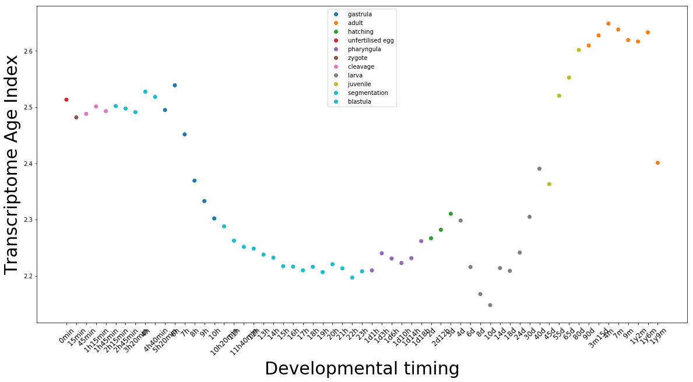
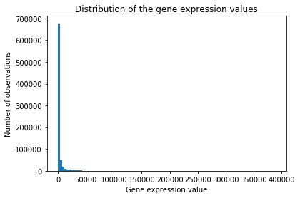
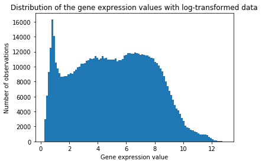
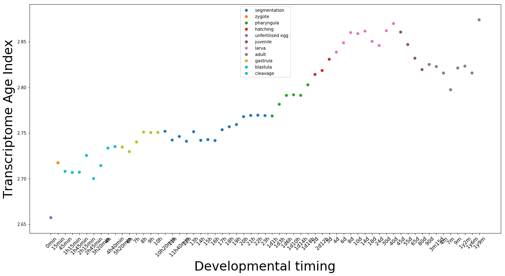
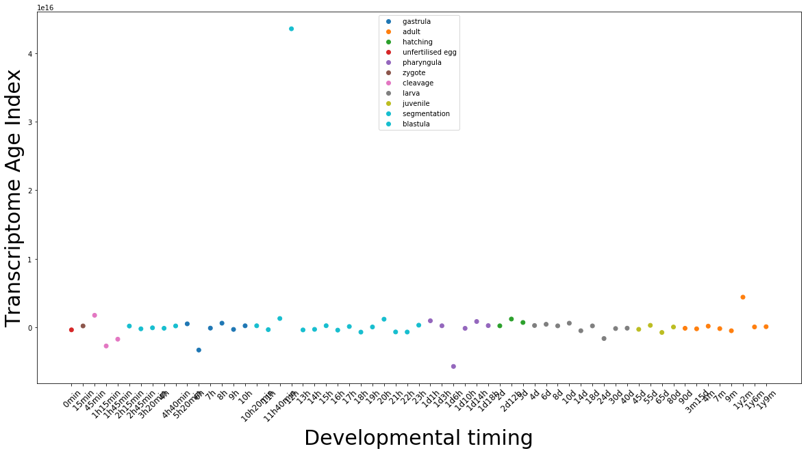

# Case Studies in Bioinformatics, Report

## Module 1: Is the hourglass model for gene expression really supported by the data?


#### Antoine Gurtler, December 2018


### Introduction
During vertebrate ontogeny, different genes or gene sets are expressed. These genes drive the development through multiples stages. During the 19th, based on morphological observations, the first embryologists logically proposed a stepping-stone model where old embryogenic characteristics are conserved. This model leads to place a 'phylotypic' stage at the beginning of the development (funnel model). Since, it has been observed that a certain stage of development was morphologically common to all kind of vertebrates. But this stage is not at the beginning of the development. It is found in the middle of the development. It gave birth to the hourglass model. According to it, the mid-embryonic period is conserved among all vertebrates when embryos show, before and after this stage, divergences (1).  This morphological observation was first molecularly supported by Hox genes expression (2). This stage is supposed to be the most constraint and so, the most conserved. Some studies tried to highlight a relation between gene conservation and gene expression among developmental stages. Domazet-Lošo and Tautz (3) used phylostratigraphy and stage-specific gene expression data to compute an index representing the evolutionary age of the transcriptome for each stage. Phylostratigraphy gives to genes from a genome a phylogenetic rank. 
This report investigates the figure 1a of the Domazet-Lošo and Tautz publication (3). It explains the process used to product this figure, from the untreated data to the figure and discuss the latter. 


### Methods
We reproduced the figure 1a of the paper (3) on python 3 using the following packages: pandas, numpy, GEOparse and matplotlib.pyplot. We used the available expression data from the article and the dario_age_index which links probID, gene name and age of the gene together. 

First, we have to dowload and extract gene expression data and metadata from the GPL file. These meaningful metadata are the stage, time, sex and sample name. 


```python
import pandas as pd
import numpy as np
import GEOparse
import matplotlib.pyplot as plt
```


```python
############# Download the data
file_name = 'GSE24616'
gse = GEOparse.get_GEO(geo=file_name, destdir="./")
########### Read in age index data
age_index = pd.read_csv('danio_age_index.txt', sep='\t', header=None)
age_index.columns = ["GeneID","ProbeID","age"]
########### Set ProbeID as the index of dataframe
age_index.set_index('ProbeID',inplace=True)

```

    29-Dec-2018 11:29:23 DEBUG utils - Directory ./ already exists. Skipping.
    29-Dec-2018 11:29:23 INFO GEOparse - File already exist: using local version.
    29-Dec-2018 11:29:23 INFO GEOparse - Parsing ./GSE24616_family.soft.gz: 
    29-Dec-2018 11:29:23 DEBUG GEOparse - DATABASE: GeoMiame
    29-Dec-2018 11:29:23 DEBUG GEOparse - SERIES: GSE24616
    29-Dec-2018 11:29:23 DEBUG GEOparse - PLATFORM: GPL6457
    29-Dec-2018 11:29:26 DEBUG GEOparse - SAMPLE: GSM606866
    29-Dec-2018 11:29:26 DEBUG GEOparse - SAMPLE: GSM606867
    29-Dec-2018 11:29:26 DEBUG GEOparse - SAMPLE: GSM606868
    29-Dec-2018 11:29:26 DEBUG GEOparse - SAMPLE: GSM606869
    29-Dec-2018 11:29:27 DEBUG GEOparse - SAMPLE: GSM606870
    29-Dec-2018 11:29:27 DEBUG GEOparse - SAMPLE: GSM606871
    29-Dec-2018 11:29:27 DEBUG GEOparse - SAMPLE: GSM606872
    29-Dec-2018 11:29:28 DEBUG GEOparse - SAMPLE: GSM606873
    29-Dec-2018 11:29:28 DEBUG GEOparse - SAMPLE: GSM606874
    29-Dec-2018 11:29:28 DEBUG GEOparse - SAMPLE: GSM606875
    29-Dec-2018 11:29:29 DEBUG GEOparse - SAMPLE: GSM606876
    29-Dec-2018 11:29:29 DEBUG GEOparse - SAMPLE: GSM606877
    29-Dec-2018 11:29:29 DEBUG GEOparse - SAMPLE: GSM606878
    29-Dec-2018 11:29:29 DEBUG GEOparse - SAMPLE: GSM606879
    29-Dec-2018 11:29:30 DEBUG GEOparse - SAMPLE: GSM606880
    29-Dec-2018 11:29:30 DEBUG GEOparse - SAMPLE: GSM606881
    29-Dec-2018 11:29:30 DEBUG GEOparse - SAMPLE: GSM606882
    29-Dec-2018 11:29:31 DEBUG GEOparse - SAMPLE: GSM606883
    29-Dec-2018 11:29:31 DEBUG GEOparse - SAMPLE: GSM606884
    29-Dec-2018 11:29:31 DEBUG GEOparse - SAMPLE: GSM606885
    29-Dec-2018 11:29:31 DEBUG GEOparse - SAMPLE: GSM606886
    29-Dec-2018 11:29:32 DEBUG GEOparse - SAMPLE: GSM606887
    29-Dec-2018 11:29:32 DEBUG GEOparse - SAMPLE: GSM606888
    29-Dec-2018 11:29:32 DEBUG GEOparse - SAMPLE: GSM606889
    29-Dec-2018 11:29:33 DEBUG GEOparse - SAMPLE: GSM606890
    29-Dec-2018 11:29:33 DEBUG GEOparse - SAMPLE: GSM606891
    29-Dec-2018 11:29:33 DEBUG GEOparse - SAMPLE: GSM606892
    29-Dec-2018 11:29:34 DEBUG GEOparse - SAMPLE: GSM606893
    29-Dec-2018 11:29:34 DEBUG GEOparse - SAMPLE: GSM606894
    29-Dec-2018 11:29:34 DEBUG GEOparse - SAMPLE: GSM606895
    29-Dec-2018 11:29:35 DEBUG GEOparse - SAMPLE: GSM606896
    29-Dec-2018 11:29:35 DEBUG GEOparse - SAMPLE: GSM606897
    29-Dec-2018 11:29:35 DEBUG GEOparse - SAMPLE: GSM606898
    29-Dec-2018 11:29:36 DEBUG GEOparse - SAMPLE: GSM606899
    29-Dec-2018 11:29:36 DEBUG GEOparse - SAMPLE: GSM606900
    29-Dec-2018 11:29:36 DEBUG GEOparse - SAMPLE: GSM606901
    29-Dec-2018 11:29:37 DEBUG GEOparse - SAMPLE: GSM606902
    29-Dec-2018 11:29:37 DEBUG GEOparse - SAMPLE: GSM606903
    29-Dec-2018 11:29:37 DEBUG GEOparse - SAMPLE: GSM606904
    29-Dec-2018 11:29:37 DEBUG GEOparse - SAMPLE: GSM606905
    29-Dec-2018 11:29:38 DEBUG GEOparse - SAMPLE: GSM606906
    29-Dec-2018 11:29:38 DEBUG GEOparse - SAMPLE: GSM606907
    29-Dec-2018 11:29:38 DEBUG GEOparse - SAMPLE: GSM606908
    29-Dec-2018 11:29:39 DEBUG GEOparse - SAMPLE: GSM606909
    29-Dec-2018 11:29:39 DEBUG GEOparse - SAMPLE: GSM606910
    29-Dec-2018 11:29:39 DEBUG GEOparse - SAMPLE: GSM606911
    29-Dec-2018 11:29:40 DEBUG GEOparse - SAMPLE: GSM606912
    29-Dec-2018 11:29:40 DEBUG GEOparse - SAMPLE: GSM606913
    29-Dec-2018 11:29:40 DEBUG GEOparse - SAMPLE: GSM606914
    29-Dec-2018 11:29:41 DEBUG GEOparse - SAMPLE: GSM606915
    29-Dec-2018 11:29:41 DEBUG GEOparse - SAMPLE: GSM606916
    29-Dec-2018 11:29:41 DEBUG GEOparse - SAMPLE: GSM606917
    29-Dec-2018 11:29:42 DEBUG GEOparse - SAMPLE: GSM606918
    29-Dec-2018 11:29:42 DEBUG GEOparse - SAMPLE: GSM606919
    29-Dec-2018 11:29:42 DEBUG GEOparse - SAMPLE: GSM606920
    29-Dec-2018 11:29:42 DEBUG GEOparse - SAMPLE: GSM606921
    29-Dec-2018 11:29:43 DEBUG GEOparse - SAMPLE: GSM606922
    29-Dec-2018 11:29:43 DEBUG GEOparse - SAMPLE: GSM606923
    29-Dec-2018 11:29:43 DEBUG GEOparse - SAMPLE: GSM606924
    29-Dec-2018 11:29:44 DEBUG GEOparse - SAMPLE: GSM606925
    29-Dec-2018 11:29:44 DEBUG GEOparse - SAMPLE: GSM606926
    29-Dec-2018 11:29:44 DEBUG GEOparse - SAMPLE: GSM606927
    29-Dec-2018 11:29:45 DEBUG GEOparse - SAMPLE: GSM606928
    29-Dec-2018 11:29:45 DEBUG GEOparse - SAMPLE: GSM606929
    29-Dec-2018 11:29:45 DEBUG GEOparse - SAMPLE: GSM606930
    29-Dec-2018 11:29:46 DEBUG GEOparse - SAMPLE: GSM606931
    29-Dec-2018 11:29:46 DEBUG GEOparse - SAMPLE: GSM606932
    29-Dec-2018 11:29:46 DEBUG GEOparse - SAMPLE: GSM606933
    29-Dec-2018 11:29:47 DEBUG GEOparse - SAMPLE: GSM606934
    29-Dec-2018 11:29:47 DEBUG GEOparse - SAMPLE: GSM606935
    29-Dec-2018 11:29:48 DEBUG GEOparse - SAMPLE: GSM606936
    29-Dec-2018 11:29:48 DEBUG GEOparse - SAMPLE: GSM606937
    29-Dec-2018 11:29:48 DEBUG GEOparse - SAMPLE: GSM606938
    29-Dec-2018 11:29:49 DEBUG GEOparse - SAMPLE: GSM606939
    29-Dec-2018 11:29:49 DEBUG GEOparse - SAMPLE: GSM606940
    29-Dec-2018 11:29:50 DEBUG GEOparse - SAMPLE: GSM606941
    29-Dec-2018 11:29:50 DEBUG GEOparse - SAMPLE: GSM606942
    29-Dec-2018 11:29:50 DEBUG GEOparse - SAMPLE: GSM606943
    29-Dec-2018 11:29:50 DEBUG GEOparse - SAMPLE: GSM606944
    29-Dec-2018 11:29:51 DEBUG GEOparse - SAMPLE: GSM606945
    29-Dec-2018 11:29:51 DEBUG GEOparse - SAMPLE: GSM606946
    29-Dec-2018 11:29:52 DEBUG GEOparse - SAMPLE: GSM606947
    29-Dec-2018 11:29:52 DEBUG GEOparse - SAMPLE: GSM606948
    29-Dec-2018 11:29:53 DEBUG GEOparse - SAMPLE: GSM606949
    29-Dec-2018 11:29:53 DEBUG GEOparse - SAMPLE: GSM606950
    29-Dec-2018 11:29:54 DEBUG GEOparse - SAMPLE: GSM606951
    29-Dec-2018 11:29:54 DEBUG GEOparse - SAMPLE: GSM606952
    29-Dec-2018 11:29:55 DEBUG GEOparse - SAMPLE: GSM606953
    29-Dec-2018 11:29:55 DEBUG GEOparse - SAMPLE: GSM606954
    29-Dec-2018 11:29:55 DEBUG GEOparse - SAMPLE: GSM606955
    29-Dec-2018 11:29:56 DEBUG GEOparse - SAMPLE: GSM606956
    29-Dec-2018 11:29:56 DEBUG GEOparse - SAMPLE: GSM606957
    29-Dec-2018 11:29:56 DEBUG GEOparse - SAMPLE: GSM606958
    29-Dec-2018 11:29:57 DEBUG GEOparse - SAMPLE: GSM606959
    29-Dec-2018 11:29:57 DEBUG GEOparse - SAMPLE: GSM606960
    29-Dec-2018 11:29:57 DEBUG GEOparse - SAMPLE: GSM606961
    29-Dec-2018 11:29:58 DEBUG GEOparse - SAMPLE: GSM606962
    29-Dec-2018 11:29:58 DEBUG GEOparse - SAMPLE: GSM606963
    29-Dec-2018 11:29:58 DEBUG GEOparse - SAMPLE: GSM606964
    29-Dec-2018 11:29:59 DEBUG GEOparse - SAMPLE: GSM606965
    29-Dec-2018 11:29:59 DEBUG GEOparse - SAMPLE: GSM606966
    29-Dec-2018 11:30:00 DEBUG GEOparse - SAMPLE: GSM606967
    29-Dec-2018 11:30:00 DEBUG GEOparse - SAMPLE: GSM606968
    29-Dec-2018 11:30:01 DEBUG GEOparse - SAMPLE: GSM606969
    29-Dec-2018 11:30:01 DEBUG GEOparse - SAMPLE: GSM606970
    29-Dec-2018 11:30:01 DEBUG GEOparse - SAMPLE: GSM606971
    29-Dec-2018 11:30:02 DEBUG GEOparse - SAMPLE: GSM606972
    29-Dec-2018 11:30:02 DEBUG GEOparse - SAMPLE: GSM606973
    29-Dec-2018 11:30:02 DEBUG GEOparse - SAMPLE: GSM606974
    29-Dec-2018 11:30:03 DEBUG GEOparse - SAMPLE: GSM606975
    29-Dec-2018 11:30:03 DEBUG GEOparse - SAMPLE: GSM606976
    29-Dec-2018 11:30:03 DEBUG GEOparse - SAMPLE: GSM606977
    29-Dec-2018 11:30:04 DEBUG GEOparse - SAMPLE: GSM606978
    29-Dec-2018 11:30:04 DEBUG GEOparse - SAMPLE: GSM606979
    29-Dec-2018 11:30:04 DEBUG GEOparse - SAMPLE: GSM606980
    29-Dec-2018 11:30:04 DEBUG GEOparse - SAMPLE: GSM606981
    29-Dec-2018 11:30:05 DEBUG GEOparse - SAMPLE: GSM606982
    29-Dec-2018 11:30:05 DEBUG GEOparse - SAMPLE: GSM606983
    29-Dec-2018 11:30:05 DEBUG GEOparse - SAMPLE: GSM606984
    29-Dec-2018 11:30:06 DEBUG GEOparse - SAMPLE: GSM606985
    29-Dec-2018 11:30:06 DEBUG GEOparse - SAMPLE: GSM606986
    29-Dec-2018 11:30:06 DEBUG GEOparse - SAMPLE: GSM606987
    29-Dec-2018 11:30:06 DEBUG GEOparse - SAMPLE: GSM606988
    29-Dec-2018 11:30:07 DEBUG GEOparse - SAMPLE: GSM606989
    29-Dec-2018 11:30:07 DEBUG GEOparse - SAMPLE: GSM606990
    29-Dec-2018 11:30:07 DEBUG GEOparse - SAMPLE: GSM606991
    29-Dec-2018 11:30:08 DEBUG GEOparse - SAMPLE: GSM606992
    29-Dec-2018 11:30:08 DEBUG GEOparse - SAMPLE: GSM606993
    29-Dec-2018 11:30:08 DEBUG GEOparse - SAMPLE: GSM606994
    29-Dec-2018 11:30:08 DEBUG GEOparse - SAMPLE: GSM606995
    29-Dec-2018 11:30:09 DEBUG GEOparse - SAMPLE: GSM606996
    29-Dec-2018 11:30:09 DEBUG GEOparse - SAMPLE: GSM606997
    29-Dec-2018 11:30:09 DEBUG GEOparse - SAMPLE: GSM606998
    29-Dec-2018 11:30:10 DEBUG GEOparse - SAMPLE: GSM606999
    29-Dec-2018 11:30:10 DEBUG GEOparse - SAMPLE: GSM607000
    29-Dec-2018 11:30:10 DEBUG GEOparse - SAMPLE: GSM607001
    29-Dec-2018 11:30:10 DEBUG GEOparse - SAMPLE: GSM607002
    29-Dec-2018 11:30:11 DEBUG GEOparse - SAMPLE: GSM607003
    29-Dec-2018 11:30:11 DEBUG GEOparse - SAMPLE: GSM607004
    29-Dec-2018 11:30:11 DEBUG GEOparse - SAMPLE: GSM607005
    29-Dec-2018 11:30:12 DEBUG GEOparse - SAMPLE: GSM607006
    29-Dec-2018 11:30:12 DEBUG GEOparse - SAMPLE: GSM607007
    29-Dec-2018 11:30:12 DEBUG GEOparse - SAMPLE: GSM607008
    29-Dec-2018 11:30:12 DEBUG GEOparse - SAMPLE: GSM607009
    29-Dec-2018 11:30:13 DEBUG GEOparse - SAMPLE: GSM607010
    29-Dec-2018 11:30:13 DEBUG GEOparse - SAMPLE: GSM607011
    29-Dec-2018 11:30:13 DEBUG GEOparse - SAMPLE: GSM607012


```python
############### Extract GSE metadata
characteristics = {"stage":[],"time":[],"sex":[],"sample_name":[]}
for gsm_name, gsm in gse.gsms.items():
    characteristics["stage"].append(gsm.metadata['characteristics_ch1'][1].split(":")[1].rstrip())
    characteristics["time"].append(gsm.metadata['characteristics_ch1'][2].split(":")[1].rstrip())
    characteristics["sex"].append(gsm.metadata['characteristics_ch1'][3].split(":")[1].rstrip())
    characteristics["sample_name"].append(gsm_name)
char_df = pd.DataFrame(characteristics,index = characteristics["sample_name"])


# Exctract expression data and add ProbeID as the index of gene expression dataframe

data = gse.pivot_samples('VALUE') 
gpl = list(gse.gpls.values())[0]
data.set_index(gpl.table.SPOT_ID,inplace=True)
data.head()
```


<div>
<style scoped>
    .dataframe tbody tr th:only-of-type {
        vertical-align: middle;
    }

    .dataframe tbody tr th {
        vertical-align: top;
    }

    .dataframe thead th {
        text-align: right;
    }
</style>
<table border="1" class="dataframe">
  <thead>
    <tr style="text-align: right;">
      <th>name</th>
      <th>GSM606866</th>
      <th>GSM606867</th>
      <th>GSM606868</th>
      <th>GSM606869</th>
      <th>GSM606870</th>
      <th>GSM606871</th>
      <th>GSM606872</th>
      <th>GSM606873</th>
      <th>GSM606874</th>
      <th>GSM606875</th>
      <th>...</th>
      <th>GSM607003</th>
      <th>GSM607004</th>
      <th>GSM607005</th>
      <th>GSM607006</th>
      <th>GSM607007</th>
      <th>GSM607008</th>
      <th>GSM607009</th>
      <th>GSM607010</th>
      <th>GSM607011</th>
      <th>GSM607012</th>
    </tr>
    <tr>
      <th>SPOT_ID</th>
      <th></th>
      <th></th>
      <th></th>
      <th></th>
      <th></th>
      <th></th>
      <th></th>
      <th></th>
      <th></th>
      <th></th>
      <th></th>
      <th></th>
      <th></th>
      <th></th>
      <th></th>
      <th></th>
      <th></th>
      <th></th>
      <th></th>
      <th></th>
      <th></th>
    </tr>
  </thead>
  <tbody>
    <tr>
      <th>GE_BrightCorner</th>
      <td>2198.829000</td>
      <td>3423.815000</td>
      <td>5245.255000</td>
      <td>2656.675000</td>
      <td>2740.922000</td>
      <td>1208.451000</td>
      <td>3875.168000</td>
      <td>926.662800</td>
      <td>3021.344000</td>
      <td>765.549300</td>
      <td>...</td>
      <td>12708.520000</td>
      <td>23294.430000</td>
      <td>10722.180000</td>
      <td>24330.310000</td>
      <td>29480.190000</td>
      <td>20457.390000</td>
      <td>18390.590000</td>
      <td>26210.390000</td>
      <td>10851.740000</td>
      <td>17487.050000</td>
    </tr>
    <tr>
      <th>DarkCorner</th>
      <td>1.828270</td>
      <td>1.688187</td>
      <td>1.899551</td>
      <td>12.481780</td>
      <td>2.004580</td>
      <td>3.587970</td>
      <td>1.529305</td>
      <td>3.663420</td>
      <td>2.086261</td>
      <td>3.186669</td>
      <td>...</td>
      <td>1.553017</td>
      <td>1.999170</td>
      <td>1.768362</td>
      <td>2.001343</td>
      <td>3.586912</td>
      <td>2.546218</td>
      <td>1.969371</td>
      <td>2.012405</td>
      <td>1.724354</td>
      <td>2.183637</td>
    </tr>
    <tr>
      <th>DarkCorner</th>
      <td>1.814322</td>
      <td>1.661080</td>
      <td>1.882490</td>
      <td>3.959911</td>
      <td>1.987528</td>
      <td>3.544706</td>
      <td>1.528030</td>
      <td>3.622770</td>
      <td>1.651873</td>
      <td>3.174333</td>
      <td>...</td>
      <td>1.549721</td>
      <td>1.972754</td>
      <td>2.009576</td>
      <td>2.013115</td>
      <td>3.567659</td>
      <td>2.938484</td>
      <td>1.960481</td>
      <td>1.986355</td>
      <td>1.719703</td>
      <td>2.168328</td>
    </tr>
    <tr>
      <th>DarkCorner</th>
      <td>1.802108</td>
      <td>1.638321</td>
      <td>1.866866</td>
      <td>3.926815</td>
      <td>1.970980</td>
      <td>3.505050</td>
      <td>1.526956</td>
      <td>3.584835</td>
      <td>1.632490</td>
      <td>3.165061</td>
      <td>...</td>
      <td>1.546694</td>
      <td>1.946565</td>
      <td>1.752027</td>
      <td>2.187902</td>
      <td>3.549810</td>
      <td>9.200152</td>
      <td>1.952024</td>
      <td>2.015073</td>
      <td>1.715524</td>
      <td>2.154715</td>
    </tr>
    <tr>
      <th>DarkCorner</th>
      <td>1.791820</td>
      <td>1.619080</td>
      <td>1.852417</td>
      <td>4.298274</td>
      <td>1.956618</td>
      <td>3.469137</td>
      <td>1.525998</td>
      <td>3.550271</td>
      <td>1.616239</td>
      <td>3.514396</td>
      <td>...</td>
      <td>1.543944</td>
      <td>1.921874</td>
      <td>3.408343</td>
      <td>2.032328</td>
      <td>3.533114</td>
      <td>2.611924</td>
      <td>1.944300</td>
      <td>1.940361</td>
      <td>1.711701</td>
      <td>2.141993</td>
    </tr>
  </tbody>
</table>
<p>5 rows × 147 columns</p>
</div>


Then we reduced the gene expression datafram to the probID found in the age_index index. This file also contains the gene associate with the prob and an integer linked to the gene age (stratigraphy index) (1 = old, 14 =young)


```python
matched_data =data.join(age_index,how='inner').groupby(level=0).last()
```

Some genes are reported by multiples probes, so we merged their expression together to have one line per gene. Authors of the original paper (3) did not do it (4). Then, we excluded male samples.

Then, we calculated the average gene expression for similar time points. There is 61 time points, separated in eleven developmental stages. We also associate a developmental stage to the corresponding time points. 


```python
# Average out multiple transcripts
unique_data = matched_data.groupby('GeneID').mean()

# Select only female and mixed sample.
char_df= char_df[char_df["sex"]!=' male']

########## find samples of the same time points
experiment_index=[]
time_stamps = char_df.time.unique()
for t in time_stamps:
    experiment_index.append(char_df[char_df['time']==t].index.tolist())

########### average the samples for similar time points
set_mean = {}
stages = []
timestamps=[]
for d in range(len(experiment_index)) :
    sample_list=experiment_index[d]
    set_mean[d]=unique_data[sample_list].mean(axis=1)
    stages.append(char_df[char_df.index.isin(sample_list)].stage[0])
    timestamps.append(char_df[char_df.index.isin(sample_list)].time[0])
mean_data = pd.DataFrame(set_mean)
mean_data.columns= stages
print(mean_data.shape)
mean_data.head()
```

    (12892, 61)


<div>
<style scoped>
    .dataframe tbody tr th:only-of-type {
        vertical-align: middle;
    }

    .dataframe tbody tr th {
        vertical-align: top;
    }

    .dataframe thead th {
        text-align: right;
    }
</style>
<table border="1" class="dataframe">
  <thead>
    <tr style="text-align: right;">
      <th></th>
      <th>unfertilised egg</th>
      <th>zygote</th>
      <th>cleavage</th>
      <th>cleavage</th>
      <th>cleavage</th>
      <th>blastula</th>
      <th>blastula</th>
      <th>blastula</th>
      <th>blastula</th>
      <th>blastula</th>
      <th>...</th>
      <th>juvenile</th>
      <th>juvenile</th>
      <th>adult</th>
      <th>adult</th>
      <th>adult</th>
      <th>adult</th>
      <th>adult</th>
      <th>adult</th>
      <th>adult</th>
      <th>adult</th>
    </tr>
    <tr>
      <th>GeneID</th>
      <th></th>
      <th></th>
      <th></th>
      <th></th>
      <th></th>
      <th></th>
      <th></th>
      <th></th>
      <th></th>
      <th></th>
      <th></th>
      <th></th>
      <th></th>
      <th></th>
      <th></th>
      <th></th>
      <th></th>
      <th></th>
      <th></th>
      <th></th>
      <th></th>
    </tr>
  </thead>
  <tbody>
    <tr>
      <th>ENSDARG00000000001</th>
      <td>43.579775</td>
      <td>83.443125</td>
      <td>71.119810</td>
      <td>63.03143</td>
      <td>60.628190</td>
      <td>49.01749</td>
      <td>49.549605</td>
      <td>43.79437</td>
      <td>33.41657</td>
      <td>32.97779</td>
      <td>...</td>
      <td>43.74697</td>
      <td>53.750925</td>
      <td>50.525365</td>
      <td>45.79091</td>
      <td>66.605335</td>
      <td>108.772475</td>
      <td>93.719485</td>
      <td>114.51177</td>
      <td>114.384435</td>
      <td>34.181425</td>
    </tr>
    <tr>
      <th>ENSDARG00000000002</th>
      <td>22.852215</td>
      <td>25.191140</td>
      <td>23.353835</td>
      <td>24.72841</td>
      <td>26.720193</td>
      <td>39.59848</td>
      <td>39.728450</td>
      <td>35.82690</td>
      <td>26.27642</td>
      <td>22.81932</td>
      <td>...</td>
      <td>746.71440</td>
      <td>540.680800</td>
      <td>597.622950</td>
      <td>573.15160</td>
      <td>400.438450</td>
      <td>385.692150</td>
      <td>463.057400</td>
      <td>411.58645</td>
      <td>354.381250</td>
      <td>455.134075</td>
    </tr>
    <tr>
      <th>ENSDARG00000000018</th>
      <td>4407.521500</td>
      <td>16676.930000</td>
      <td>16586.750000</td>
      <td>14193.80000</td>
      <td>13119.660000</td>
      <td>16973.08500</td>
      <td>16721.610000</td>
      <td>11987.34000</td>
      <td>10809.15350</td>
      <td>12519.80500</td>
      <td>...</td>
      <td>5769.60250</td>
      <td>7716.946500</td>
      <td>7921.420000</td>
      <td>10432.38250</td>
      <td>11508.055000</td>
      <td>18600.865000</td>
      <td>10988.534000</td>
      <td>14121.77000</td>
      <td>15040.460000</td>
      <td>8207.264750</td>
    </tr>
    <tr>
      <th>ENSDARG00000000019</th>
      <td>136.711650</td>
      <td>346.580000</td>
      <td>384.074250</td>
      <td>307.73120</td>
      <td>341.886633</td>
      <td>337.51405</td>
      <td>333.049150</td>
      <td>259.48750</td>
      <td>227.49525</td>
      <td>247.80375</td>
      <td>...</td>
      <td>634.64195</td>
      <td>911.222950</td>
      <td>960.104900</td>
      <td>1281.17205</td>
      <td>1694.315500</td>
      <td>2732.318500</td>
      <td>1166.058450</td>
      <td>2106.93150</td>
      <td>2243.022000</td>
      <td>1569.307375</td>
    </tr>
    <tr>
      <th>ENSDARG00000000068</th>
      <td>7669.822500</td>
      <td>13730.230000</td>
      <td>14103.435000</td>
      <td>13847.34500</td>
      <td>17017.293333</td>
      <td>16465.23500</td>
      <td>15704.555000</td>
      <td>13742.96000</td>
      <td>12857.69000</td>
      <td>12257.20500</td>
      <td>...</td>
      <td>21274.32500</td>
      <td>17284.360000</td>
      <td>13999.060000</td>
      <td>14570.68500</td>
      <td>15822.270000</td>
      <td>21657.840000</td>
      <td>16054.155000</td>
      <td>18389.46000</td>
      <td>19896.755000</td>
      <td>10289.684250</td>
    </tr>
  </tbody>
</table>
<p>5 rows × 61 columns</p>
</div>


The final table has 12892 rows and 61 columns, for 12892 genes and 61 time points. 

### Results. 

With this table containing the average gene expression per time point, we can calculate the transcriptome gene index (TAI) of each time point as decribed in the paper. 

$$TAI_s = \frac{\sum_{i=1}^n ps_i e_i}{\sum_{i=1}^n e_i}$$

* $ps_i$ is the phylostratum number of the gene i and $e_i$ its expression.


```python
########### Calculating TAI
age_indices =unique_data['age']
expression_data = mean_data.values
product = np.dot(expression_data.T,age_indices)
mean_expression = expression_data.T.sum(1)
TAI = np.divide(product,mean_expression)
```

We reproduced the figure 1a of the publication by plotting the 61 calculated TAIs. 


```python
#### define color map
unique_stages= list(set(stages))
color_list = plt.cm.tab10(np.linspace(0, 1, len(unique_stages))) 
color = {unique_stages[i]:color_list[i] for i in range(len(unique_stages))}
my_col= [color[i] for i in stages]

plt.figure(figsize=(20,10))
plt.scatter(range(len(TAI)),TAI,color=my_col,linestyle='-')
plt.xticks(range(len(TAI)),timestamps,rotation=45,size=12)
plt.ylabel("Transcriptome Age Index",size=30)
plt.xlabel("Developmental timing",size=30)
markers = [plt.Line2D([0,0],[0,0],color=c, marker='o', linestyle='') for c in color.values()]
plt.legend(markers,color.keys(),loc='upper center')
plt.show()
# write your code here 
```





*Figure 1: **Figure 1a reproduction** The x-axis represents the different time points, y-axis is the TAI. Color of the points corresponds to the developmental stage.*

According to this figure, we see that genes expressed during the mid-embryonic period have the lower TAI, so they are the oldest genes. 

However, if we look at the distribution of gene expression values, we see that most of the data have a really low expression. It means that only a few genes, ones with a strong expression, contribute to the pattern observed, which, surely by chance, correponds to a hourglass pattern. 


```python
plt.figure()
plt.hist(expression_data.reshape((expression_data.shape[0]*expression_data.shape[1],1)),bins=100)
plt.title('Distribution of the gene expression values')
plt.xlabel('Gene expression value')
plt.ylabel('Number of observations')
plt.show()
```





*Figure 2: **Distribution of the gene expression values**.*

If we apply a log-transformation to the data. They display a log-normal distribution which allows to compare data to each other. 


```python
plt.figure()
plt.hist(np.log(expression_data.reshape((expression_data.shape[0]*expression_data.shape[1],1))),bins=100)
plt.title('Distribution of the gene expression values with log-transformed data')
plt.xlabel('Gene expression value')
plt.ylabel('Number of observations')
plt.show()
```





*Figure 3: **Distribution of the log transformed gene expression**.*

Then, we can redo the plot with the normalized data.


```python
########### Calculating TAI


age_indices =unique_data['age']
expression_data = np.log(mean_data.values)
product = np.dot(expression_data.T,age_indices)
mean_expression = expression_data.T.sum(1)
TAI = np.divide(product,mean_expression)

#### define color map

unique_stages= list(set(stages))
color_list = plt.cm.tab10(np.linspace(0, 1, len(unique_stages))) 
color = {unique_stages[i]:color_list[i] for i in range(len(unique_stages))}
my_col= [color[i] for i in stages]

plt.figure(figsize=(20,10))
plt.scatter(range(len(TAI)),TAI,color=my_col,linestyle='-')
plt.xticks(range(len(TAI)),timestamps,rotation=45,size=12)
plt.ylabel("Transcriptome Age Index",size=30)
plt.xlabel("Developmental timing",size=30)
markers = [plt.Line2D([0,0],[0,0],color=c, marker='o', linestyle='') for c in color.values()]
plt.legend(markers,color.keys(),loc='upper center')
plt.savefig('TAI.png')
plt.show()
```





*Figure 4: **Transcriptome age index with log-transformed data**.* 

The normalized data changes the pattern of the graph. The lowest TAI are found during the first steps of the developpment. Trasncriptome age decreases over time. 

We can also test the sensibility to outliers by using another kind of normalization which is the z-score. This score indicates how many standard deviation a value is from the mean. 

Z-score formula is the following:

$$Z = \frac{X-\mu}{\sigma}$$

where X is the value of the element, $\mu$ the mean and $\sigma$ the standard deviation. 
source:https://stattrek.com/statistics/dictionary.aspx?definition=z_score

If we plot the data using this transformation, we observe an outlier on the fourth value of the segmentation. 


```python
########### Calculating TAI
age_indices =unique_data['age']
expression_data = (mean_data.apply(lambda x:(x-(sum(x)/len(x)))/np.std(x))).values
product = np.dot(expression_data.T,age_indices)
mean_expression = expression_data.T.sum(1)
TAI = np.divide(product,mean_expression)

#### define color map

unique_stages= list(set(stages))
color_list = plt.cm.tab10(np.linspace(0, 1, len(unique_stages))) 
color = {unique_stages[i]:color_list[i] for i in range(len(unique_stages))}
my_col= [color[i] for i in stages]

plt.figure(figsize=(20,10))
plt.scatter(range(len(TAI)),TAI,color=my_col,linestyle='-')
plt.xticks(range(len(TAI)),timestamps,rotation=45,size=12)
plt.ylabel("Transcriptome Age Index",size=30)
plt.xlabel("Developmental timing",size=30)
markers = [plt.Line2D([0,0],[0,0],color=c, marker='o', linestyle='') for c in color.values()]
plt.legend(markers,color.keys(),loc='upper center')
plt.show()


```





### Discussion:


Is the hourglass model for gene expression really supported by the data? We can answer this question now and the answer is no. This study shows how important is to normalize data. In fact, only outliers and strong expressed genes contribute to obtain a hourglass model. Data seems to support the funnel model, the one where the phylotypic stage is at the beginning of the developpement.  


### References:


1. 	Kalinka AT, Tomancak P. The evolution of early animal embryos: conservation or divergence? Trends Ecol Evol. 2012 Jul;27(7):385–93. 
2. 	Duboule D. Temporal colinearity and the phylotypic progression: a basis for the stability of a vertebrate Bauplan and the evolution of morphologies through heterochrony. Dev Camb Engl Suppl. 1994;135–42. 
3. 	Domazet-Lošo T, Tautz D. A phylogenetically based transcriptome age index mirrors ontogenetic divergence patterns. Nature. 2010 Dec;468(7325):815–8. 
4. 	Piasecka B, Lichocki P, Moretti S, Bergmann S, Robinson-Rechavi M. The Hourglass and the Early Conservation Models—Co-Existing Patterns of Developmental Constraints in Vertebrates. PLoS Genet [Internet]. 2013 Apr 25 [cited 2018 Dec 29];9(4). Available from: https://www.ncbi.nlm.nih.gov/pmc/articles/PMC3636041/
 


```python

```
